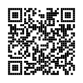

# matrix-tracer

This is a proof-of-concept of an optimized construction of grid-based 2D
barcodes (like QRcodes, DataMatrix, etc.) for anti-aliased rendering.

## Issue

Most SVG outputs in QRcode generators treat each black cell as an individual
rectangle. This causes anti-aliasing issue on shared edges, resulting in
single-pixel gray lines separating adjacent cells. This implementation solves
this issue and should also result in smaller output file size.

## This implementation

Function `generatePath` builds polygons around cells with vertical and
horizontal segment of path element, assuming `fill-rule: evenodd`.

Utilizes 2x2 sensor with two states:

- scanning - scans matrix LTR looking for loose corner,
- tracing - sliding along edges from corner to corner.

This function needs to be provided with matrix dimensions and
`(x: number, y:number) => boolean` function, so it can handle any matrix
representation.

- `src/generatePath.ts` - provides main functionality, no dependencies required
- `src/index.ts` - provides example for comparison with
  [@papnkukn/qrcode-svg](https://github.com/papnkukn/qrcode-svg)

### Pros

- no dividing lines inside islands
- single path element
- smaller output file

### Cons

- harder to manipulate cells to take advantage of error correction (logo
  placement)

### Comparison

Output of qrcode-svg uses `shape-rendering: crispEdges` style property on each
`rect` drawn which helps with the main issue. It increases file size by ~20%, it
would have no significant effect though if the style was applied to the group
encapsulating all rectangles.

This approach achieves ~50x smaller file which will display properly even if
rendering engine doesn't support `shape-rendering: crispEdges`.

|         |         qrcode-svg          |     w/o `crispEdges`      |         matrix-tracer          |
| ------: | :-------------------------: | :-----------------------: | :----------------------------: |
|  result |  |  |  |
| `wc -c` |            89504            |           74168           |              1671              |

## Further work

Find out what interface will be most suitable to be integrated with popular 2D
barcodes generators.
