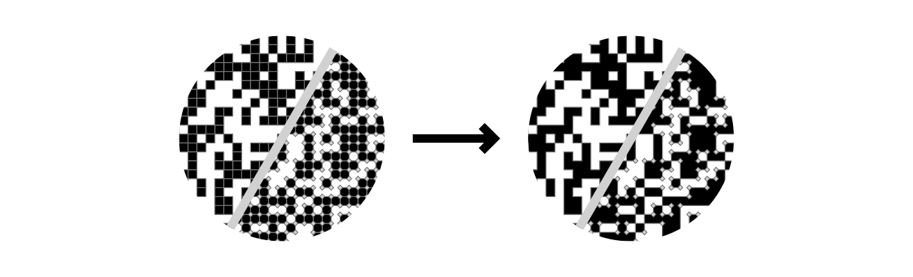

# matrix-tracer

This is a proof-of-concept of an optimized construction of grid-based 2D
barcodes (like QRcodes, DataMatrix, etc.) for anti-aliased rendering.



## Issue

Most SVG outputs in QRcode generators treat each black cell as an individual
rectangle. This causes anti-aliasing issue on shared edges, resulting in
single-pixel gray lines separating adjacent cells. This implementation solves
this issue and should also result in smaller output file size.

## Other approaches

### qrcode-svg

Output of [qrcode-svg](https://github.com/papnkukn/qrcode-svg) uses
`shape-rendering: crispEdges` style property on each `rect` drawn which helps
with the main issue (gray lines). But this property disables anti-aliasing for
specified shapes relulting in jagged eddges on non-orthogonal edges (i.e.
rotated). Also applying this property to each cell individualy increases file
size by ~20%, but it would have no significant effect if the style was applied
to the group encapsulating all rectangles.

### qrcode-svg-table

[qrcode-svg-table](https://github.com/Diophant/qrcode-svg-table) provides a
`join: true` option which draws cells inside a single path element, allowing it
to render with anit-aliasing. This seems to solve this issue, but islands are
sitll being divided into separate squares, so it lean on rendering engine to
draw it without the gaps and file size is only slightly reduced.

## This implementation

This approach draws whole matrix as a single path using vertical and horizontal
line segments with relative coordinates. Islands are not being divided. Also
`fill-rule: evenodd` is assumed so shared corners can be ignored and treated as
island intersections. Output files end up ~20-50x smaller and will render
correctly even if rendering engine doesn't support `shape-rendering: crispEdges`
or reders splits withing the path poorly.

Function `matrixTracer` utilizes 2x2 sensor with two states:

- scanning - scans matrix LTR looking for loose corner,
- tracing - sliding along edges from corner to corner.

This function needs to be provided with matrix dimensions and
`sensor = (x: number, y:number) => boolean` function, so it can handle any
matrix representation.

### Pros

- No dividing lines inside the islands
- Single path element
- Smaller output file

### Cons

- Harder to manipulate cells to take advantage of error correction, for example
  for logo placement. Although it can be easily achieved with proper `sensor`
  function - check out `punchHoleInSensor` in example.

### Example

You can check example in `example/ts/index.ts` and to run it use:

```
npm install
npm run build
npm run example
```

Output files will be rendered to `example/svg/`.

### Comparison

|         |           qrcode-svg            |       w/o `crispEdges`        |           matrix-tracer            |
| ------: | :-----------------------------: | :---------------------------: | :--------------------------------: |
|  result |  |  |  |
| `wc -c` |              89504              |             74168             |                1668                |

_Results are rotated 3° to exaggerate aliasing._

#### Close-up


### Other examples

 


## Further work

Find out what interface will be most suitable to be integrated with popular 2D
barcodes generators.
